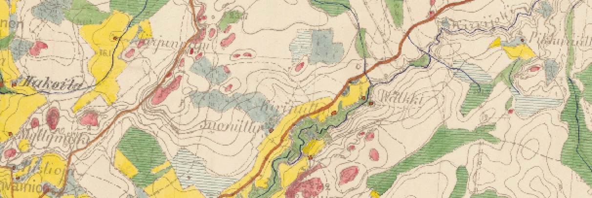

# Atelier SIGMA Neural Network

Code to create and train a neural network 

## Why does this git exist ?

Neural Networks are becoming fashionable. 
There are multiple applications for images studies. 
The goal here is to create, train, and use a neural network to predict landuse in a Finnish historical map.

## Who are we ?

Four students in the SIGMA master degree of the ENSAT INP School and the Jean Jaures Toulouse University,  willing to learn about neural networks and the Deep Learning.

## What does this git do ?

To use those scripts you will previously need to install MuseoToolbox, tensorflow, pydot, graphviz, opencv, and numpy libraries.  

The code "extract_label_nn.py" is used to the images you want to work with, it uses the polygones stored in the gpkg file and the compress image of a Finnish historical maps(example_entire_map_compress.tif).
By default, we create images of 30x30 pixels and all the label associated (all the data is furnished in the git).
We then create and train a model (neural_networks_FinlandMaps.py) to process the images. 
At the end the script gives you the overall accuracy of the model predictions and a png files of the architecture of the model.
